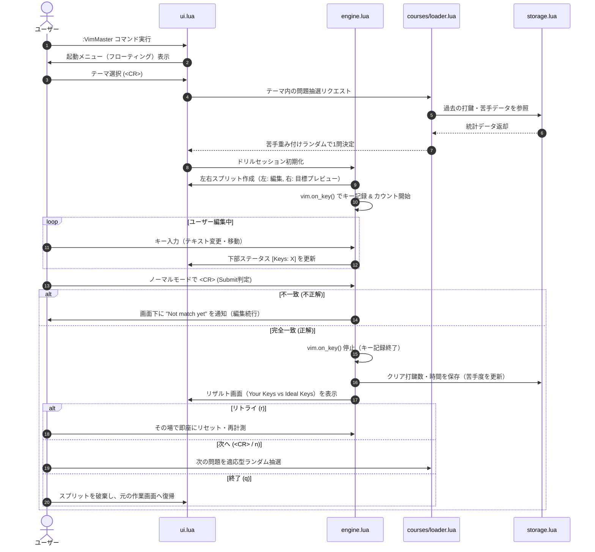

# VimMaster アーキテクチャ設計書

## 1. 実行環境・言語・前提条件

| 項目 | 採用内容 / 要件 | 選定理由・備考 |
| :--- | :--- | :--- |
| **対象エディタ** | **Neovim >= 0.8.0**（0.9+, 0.10+ 推奨） | 安定した Lua API（`vim.on_key`, `nvim_open_win` 等）を活用 |
| **開発言語** | **Lua 100%**（Neovim 組み込み LuaJIT） | 外部ランタイム不要、高速動作、Neovim ネイティブ親和性 |
| **外部依存** | **完全ゼロ（None）** | 追加バイナリ（Rust/Go/Node等）や他プラグインへの依存なし |
| **導入方式** | 標準プラグイン形式（`lazy.nvim` 等対応） | リポジトリ指定（または `dir` 指定）のみで即座に動作 |
| **データ永続化** | JSON ファイル（Neovim 標準の `vim.json`） | `stdpath("data")/vim-master/stats.json` に保存 |

---

## 2. ディレクトリ構造

標準的な Neovim プラグイン構成に準拠し、役割ごとに明確に分離します。

```text
vim-master/
├── plugin/
│   └── vim-master.lua          -- コマンド (:VimMaster) の自動登録
├── lua/
│   └── vim-master/
│       ├── init.lua            -- プラグインのエントリーポイント (setup, 起動)
│       ├── config.lua          -- ユーザー設定 (キーマップ、初期設定値)
│       ├── state.lua           -- 現在のセッション状態 (現在の問題、打鍵数、キー列)
│       ├── engine.lua          -- ドリルの実行制御、キー監視 (vim.on_key)、判定
│       ├── ui.lua              -- 画面制御 (起動小窓、左右分割、リザルト小窓)
│       ├── storage.lua         -- 学習データ・苦手スコアの読み書き (JSON)
│       └── courses/            -- 問題・テーマ群
│           ├── loader.lua      -- テーマ読み込み & 適応型ランダム選出ロジック
│           ├── lv1_motion.lua  -- Lv.1 行内移動・瞬発力
│           ├── lv2_textobj.lua -- Lv.2 テキストオブジェクト・構造操作
│           ├── lv3_multi.lua   -- Lv.3 複数行・一括編集
│           ├── practical_refactor.lua -- 実践: コードリファクタリング
│           └── practical_log.lua      -- 実践: ログ解析・データ整形
└── docs/
    ├── requirements.md         -- 要件定義書
    └── architecture.md         -- 本設計書
```

---

## 3. 主要コンポーネントの責務

| モジュール | 主な責務 | 主要な Neovim API |
| :--- | :--- | :--- |
| **`init.lua`** | プラグインの初期化、コマンドディスパッチ | `nvim_create_user_command` |
| **`config.lua`** | デフォルト設定の保持とユーザー設定のマージ | `vim.tbl_deep_extend` |
| **`engine.lua`** | 打鍵フック開始/停止、手動Submit時のテキスト比較判定 | `vim.on_key`, `nvim_buf_get_lines` |
| **`ui.lua`** | ① 起動メニュー浮動窓<br>② 左右スプリット（編集窓 + 目標窓）<br>③ 連動スクロール<br>④ リザルト浮動窓 | `nvim_open_win`, `nvim_create_buf`, `scrollbind` |
| **`storage.lua`** | 各問題の打鍵履歴・自己ベスト・苦手重みの永続化 | `vim.fn.stdpath`, `vim.json` |
| **`courses/loader.lua`** | テーマ別問題の取得、苦手重みに応じたランダム抽選 | `math.random` |

---

## 4. ライフサイクルとデータフロー



---

## 5. 設定のカスタマイズ性（`config.lua`）

ユーザーが好みに応じてキーバインドや挙動を変更できるようにします。

```lua
-- デフォルト設定のイメージ
local defaults = {
  keymaps = {
    submit = "<CR>",      -- 判定（ノーマルモード）
    reset  = "<C-c>r",    -- 最初からやり直す
    quit   = "<C-c>q",    -- ドリル中断・終了
  },
  ui = {
    border = "rounded",   -- メニューやリザルトの枠線 ('single' | 'rounded' 等)
    width_ratio = 0.5,    -- 左右スプリットの比率
  },
}
```

---

## 6. 開発・検証環境

- **開発時読み込み**:
  ユーザー自身の Neovim 設定（`~/.config/nvim/lua/plugins/drill.lua`）からローカルパス（`dir = "~/work/vim-master"`）でロード。
- **ホットリロード**:
  モジュールを編集したら、Neovim 内で `require("plenary.reload").reload_module("vim-master")` または Neovim 再起動で即時反映。
- **安全性**:
  作業バッファはすべて一時的な `buftype = "nofile"`（未保存警告なし、実ファイル破損リスクゼロ）で生成。
